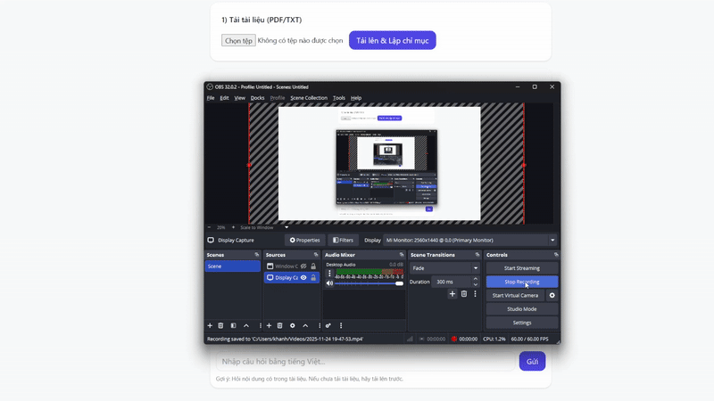

# Chatbot RAG sử dụng LangChain, FAISS và Gemini API

## 📌 Tổng quan

Dự án này xây dựng một **Chatbot RAG (Retrieval-Augmented Generation)** sử dụng:

* **LangChain** để xây dựng pipeline truy vấn + sinh câu trả lời
* **FAISS** làm vector store cho tìm kiếm tương đồng
* **Google Gemini API** để sinh câu trả lời tự nhiên và chính xác

Chatbot có khả năng trả lời các câu hỏi dựa trên **tài liệu của riêng bạn** thông qua quá trình truy xuất thông tin và tổng hợp bằng mô hình ngôn ngữ.

---

## 🚀 Tính năng chính

* 🔍 **Tìm kiếm ngữ nghĩa** bằng FAISS
* 📄 **Hỗ trợ nhiều loại tài liệu**: PDF, text, markdown, docx
* ✂️ **Tự động chunking + sinh embeddings**
* 🧠 **Pipeline RAG hoàn chỉnh**: Retriever → LLM → Answer
* 💬 **Hỗ trợ hội thoại có ngữ cảnh** (history-aware retriever)
* ⚡ **Triển khai nhanh** với FastAPI
* 📦 **Lưu trữ FAISS cục bộ** để tối ưu chi phí

---
## Demo


## 📂 Cấu trúc dự án

```
project/
├── docs                     # Lưu trữ các tài liệu 
├── db                       # Lưu trữ vector FAISS
├── src/
│   ├── app.py               # Server FastAPI
│   ├── RAG.py               # class RAG
│   ├── utils.py             # Hàm hỗ trợ: chunking, loader
│   └── db/                  # Lưu trữ vector FAISS
├── requirements.txt
├── README.md
└── .env                     # API keys

```
## 🛠️ Công nghệ sử dụng

* Python 3.13
* LangChain 1.x
* FAISS
* Google Gemini API
* FastAPI
* uvicorn
* HuggingFace

---

## 🔧 Cài đặt

### 1️⃣ Clone dự án

```bash
git clone <repo-url>
cd project
```

### 2️⃣ Cài đặt thư viện

```bash
pip install -r requirements.txt
```

### 3️⃣ Tạo file `.env`

```env
GOOGLE_API_KEY=your_api_key_here
```

## ▶️ Chạy server FastAPI

```bash
uvicorn src.main:app --reload
```

API chạy tại:

```
http://127.0.0.1:8000/
```

## ▶️ Chạy giao diện
    Chạy file index.html
---

## 🔗 Cách hoạt động của pipeline RAG

1. Người dùng gửi câu hỏi
2. Hệ thống sinh embedding từ câu hỏi
3. FAISS truy xuất các chunk tài liệu liên quan nhất
4. LangChain kết hợp context + câu hỏi
5. Gemini API sinh câu trả lời dựa trên tài liệu


## 📜 License

MIT License.

---

